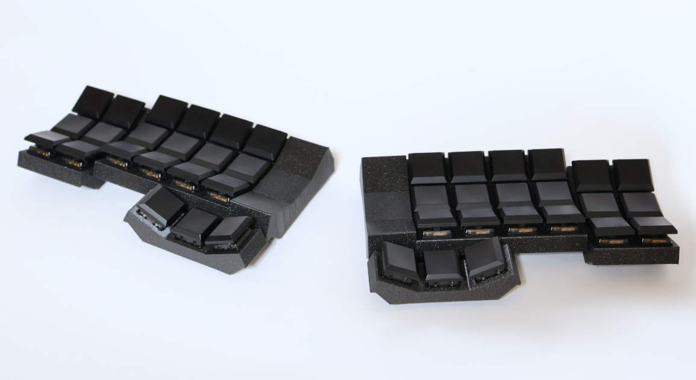
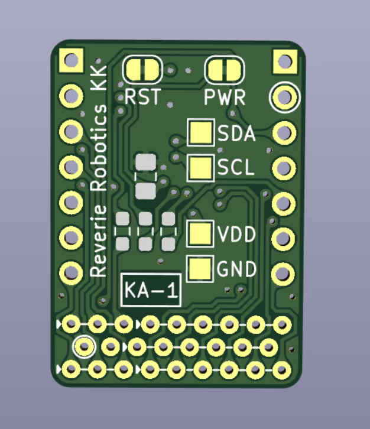
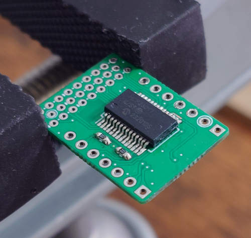
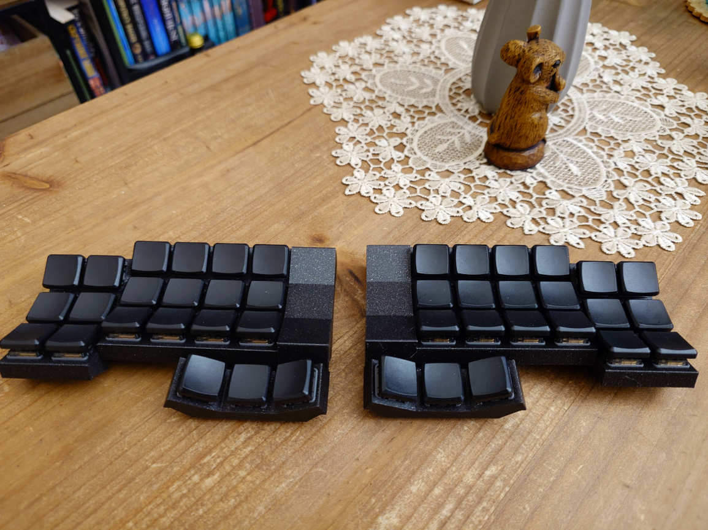

# Asanoha keyboard


## Features:
* ZMK
* XIAO BLE (nRF52840)
* Bluetooth and/or USB
* Wireless split
* 42 sockets for Kailh Choc
* Every switch has its own GPIO - no matrix scanning needed, just interrupts
* Light af
* Low profile
* True well (not just raised keycaps), with customizable angle 
* Hardware power switch
* FDM-printable chassis
* Works for months on a single charge

## Building firmware

In devcontainer:
```
west update
west build -p -b xiao_ble -S studio-rpc-usb-uart   -- -DSHIELD=asanoha_left  -DZMK_EXTRA_MODULES=/workspaces/zmk-modules/zmk-keyboard-asanoha/
west build -p -b xiao_ble -S studio-rpc-usb-uart   -- -DSHIELD=asanoha_right -DZMK_EXTRA_MODULES=/workspaces/zmk-modules/zmk-keyboard-asanoha/
```

## More photos





